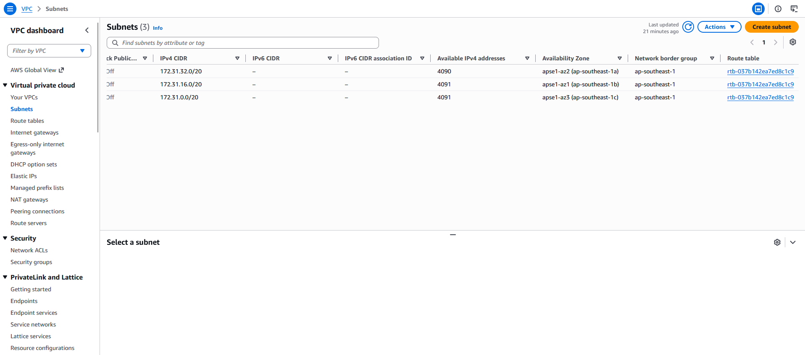
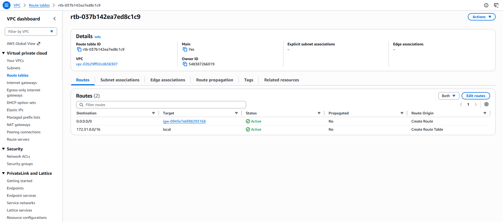
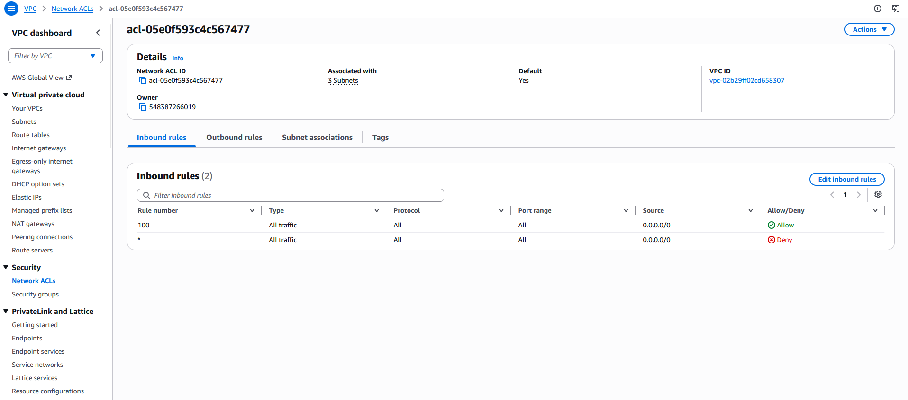
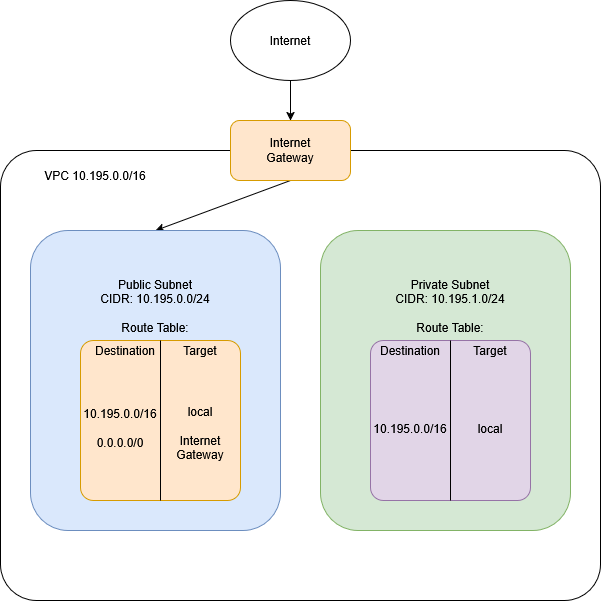

# Assignment 2 Submission

<!--
How to use this template:

1. Copy this file to submissions/assignment-2/<your-github-username>/submission.md
2. Replace every answer placeholder with your own answer. Delete the angle brackets too.
3. Save your four images in the same folder, with the exact file names below.
4. Do not write your full name or your student number in this file.
-->

## About me

- GitHub username: carlcawas
- Section: 4-ACSAD
- IAM user name that I signed in with: acsad-g02
- X: 195

---

## Part A. Explore

### A1. The VPC

Default VPC IPv4 CIDR:

172.31.0.0/16

Number of addresses in that CIDR:

65,536

### A2. The subnets

| Availability Zone | IPv4 CIDR |
| --- | --- |
| apse1-az2 (ap-southeast-1a) | 172.31.32.0/20 |
| apse1-az1 (ap-southeast-1b) | 172.31.16.0/20 |
| apse1-az3 (ap-southeast-1c) | 172.31.0.0/20 |

Screenshot 1. Save it as `screenshot-1-subnets.png` in your folder. The image line below shows it.

### A3. Available addresses

Available IPv4 addresses in each subnet:

4,091

Why is the number lower than 4,096?

because AWS keeps 5 IPs the first 4 and last one

What uses the missing address in the subnet with the lowest number?

it is attatched to the stopped or active resources since once an IP address is attached to a resources its binded to it or given to it no matter what its state is. 

### A4. The route table

| Destination | Target |
| --- | --- |
| 0.0.0.0/0 | igw-0943e7e6f88293168 |
| 172.31.0.0/16 | local |

Screenshot 2. Save it as `screenshot-2-routes.png` in your folder. The image line below shows it.

### A5. Public or private

Are the default subnets public or private? Which route proves it?

the default subnets are public since the route 0.0.0.0/0 tragets the internet gateway and if a route is directs the internet bound traffic to an internet gateway is a public subnet.  

### A6. The internet gateway

State of the internet gateway:

Attached

What happens to the default subnets if the gateway is detached?

All default subnets lose direct internet connectivity. Public IP Address will no longer be reachable from the internet or can reach external internet destinations making the subnet almost like a private one

### A7. NAT gateways

Number of NAT gateways:

0

Can a server in a new private subnet download updates? Why?

No private subnet has no route to an internet gateway. Without NAT gateway in a public subnet outbound connections to the internet cannot be translated.

### A8. The network ACL

| Rule number | Source | Allow or Deny |
| --- | --- | --- |
| 100 | 0.0.0.0/0 | Allow |
| * | 0.0.0.0/0 | Deny |

How is a network ACL different from a security group?

It acts a stateless firewall that process numbered rules, it also requires inbound and outbound rules.

Screenshot 3. Save it as `screenshot-3-network-acl.png` in your folder. The image line below shows it.

### A9. The default security group

Inbound rule (type and source):

All traffic and sg-0c5b6d4081cf0a534 / default 

Which resources can send traffic to an instance that uses it?

Only other AWS resources in the same VPC that are assigned this default security group. Other traffic from different SG are blocked.

---

## Part B. Prepare

### B1. Plan two subnets

- Public subnet CIDR: 10.195.0.0/24
- Private subnet CIDR: 10.195.1.0/24

### B2. Route tables

Route table of the public subnet:

| Destination | Target |
| --- | --- |
| 10.195.0.0/16 | local |
| 0.0.0.0/0 | internet gateway |

Route table of the private subnet:

| Destination | Target |
| --- | --- |
| 10.195.0.0/16 | local |

### B3. My VPC diagram

Tool used (Excalidraw, draw.io, Lucidchart, or paper):

draw.io

Save your diagram as `vpc-diagram.png` in your folder. The image line below shows it.

### B4. Predict a change

Can you still open the web page from your laptop? Why?

No removing the 0.0.0.0/0 route removes the path back to the internet. 

Can the instance still reach another instance in the VPC? Why?

Yes internet vpc communication relies exclusively on the local route.

### B5. Place a database

Which subnet gets the database? Why?

in the public subnet, I think that database should never be accessible from the public internet to protect attacks and unauthorized accesss. Placing it in the private subnet allows application web servers in the public subnet to reach it via vpc route but still isolated.

### B6. My question about VPCs

What is your question, and what made you think of it?

If i deploy a high-availability application tier accross all or multiple availibility zones, how does routing to a NAT gateway work if the specific Az hosting that nat gateway experiences an outage? in the readme file in section 10 it shows that NAT gateway sits in a single public subnet which creates a single point of failure. Also Ive sonly seen IPv4's how about if we were to use only the new IPv6 which is globally rouatable and it doesnt use NAT how does the VPC prevent inbound connections to a private database while still allowing outbound updates over IPv6? Over all this activity i've only seen IPv4's with private ranges. 
